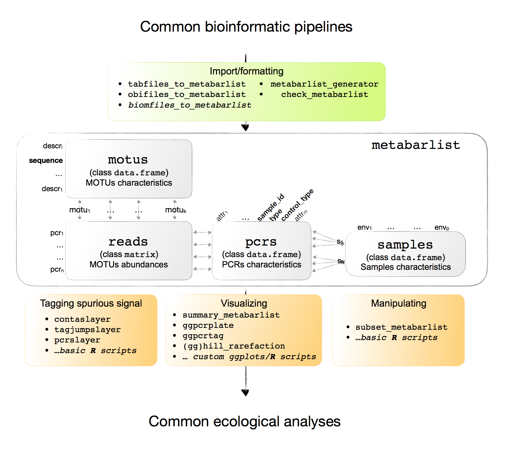
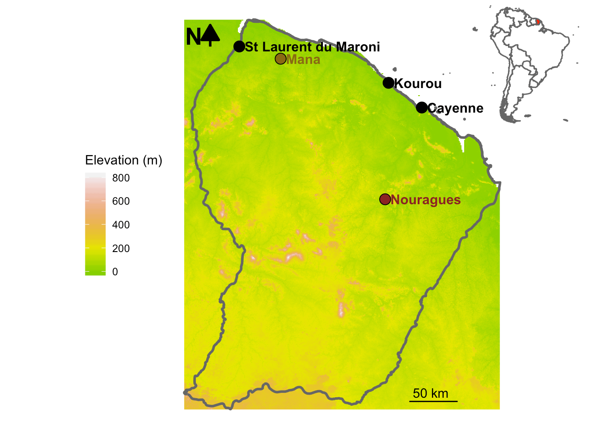

```{r setup, include = FALSE}
knitr::opts_chunk$set(
  collapse = TRUE,
  comment = "#>"
)
```

## Introduction

*MetabaR-F* is an R package enabling importing, handling and postprocessing metabarcoding data that have been already processed through bioinformatic pipelines. It provides functions to reveal and filter common molecular artifacts produced during the experimental workflow. 

Due to its simplicity of structure, this package can be easily used in combination with others R packages commonly used in ecology (*vegan*, *ade4*, *ape*, *picante*, etc.), and provides flexible graphic systems based on *ggplot2* to vizualize the data under both ecological and experimental perspectives.

## Dependencies and Installation

The phylosophy of MetabaR-F is to rely on basic R function and data structure so that to maximize fexibility and transposability across other packages. It relies on a minimal number of essential R packages :    

- *ggplot2* and *cowplot* for vizualization purposes
- *reshape2* for data manipulation purposes   
- *vegan* for basic data analyses   
- *seqinr* for handling sequence data       
- <span style="color:red">... more?</span>


To install *MetabaR-F*, use : 

```{r install, eval=FALSE}
install.packages("devtools")
devtools::install_github("metabaRfactory/metabaRffe")
```


And then load the package   
```{r loadpackage}
library(metabaRffe) # modify the name once we'll all agree on that
```


## Package overview

<span style="color:red">Temporary --- include class of each object `reads`, `motus`, `pcrs`, `samples`(data.frame, matrix, list)</span>   
{width=90%}

### Data format and structure

The basic dataformat used in *MetabaR-F* is a `metabarlist`, basically a list of four tables:   

- `reads`: a `matrix` consisting of PCRs as rows, and MOTUs as columns. Numbers of reads for each MOTUs are given in each cell, with 0 corresponding to no reads.   

- `motus`: a `data.frame` where MOTUs are listed as rows, and their attributes, typically their taxonomic information, but also any information collected during the bioinformatics analysis. A mandatory fields in this table is "sequence", i.e. the DNA sequence representative of the MOTU.    

- `pcrs`: a `data.frame` consisting of PCRs as rows, and PCRs attributes as columns. Mandatory fields are (i) "sample_id", i.e. the biological sample origin of the PCR, (ii) "type" (sample vs. control), and (iii) "control_type" (either `NA` for samples ,"extraction" for DNA extraction negative controls, "pcr" for PCR negative controls, "sequencing" for sequencing negative controls (e.g. unused tag combinations), "positive" for DNA extraction/PCR positive controls). This table can also include information related to the PCR design, such as the tags combination, the primers used, the well and plate of each PCR, etc.   

- `samples`: a `data.frame` consisting of biological samples as rows, and their information as column. Can be any type of information such as geographic coordinates, abiotic parameters, etc. This table does not include information on the DNA metabarcoding experimental controls, which can only be found in `pcrs`.


### Type of functions

*MetabaR-F* provides different types of functions:

- Import.formating functions from common bioinformatic pipelines for DNA metabarcoding data (OBITools, <span style="color:red">more to come</span>)
- Functions of data curation that are absent from the most bioinforamtic pipelines (e.g. detecting and tagging potential molecular artifacts such as contaminants, dysfynctional PCRs, etc.)    
- Functions for visualizing the data under both ecological (e.g. type of samples) and experimental (e.g. type of controls, distribution across the PCR plate design) perspectives.
- Functions to manipulate the `metabarlist` object
- <span style="color:red">Blablabla</span>


### Example dataset

An example data set is provided to facilitate reproducible examples and further developments.

The `soil_euk` dataset is a `metabarlist`. The data were obtained from an environmental DNA [eDNA] metabarcoding experiment aiming to assess the diversity of soil eukaryotes in French Guiana in two sites corresponding to two contrasting habitats:    
- Mana, a site located in a white sand forest, characterized by highly oligotrophic soils and particular tree species adapted to the local harsh conditions.
- Petit Plateau, a site located in the pristine rainforest of the Nouragues natural reserve characterized by Terra Firme soils richer in clay and organic matter. 

{width=50%}

At each site, 16 samples separated by a 20m grid were collected across a 1 ha plot. For each sampling point, two compartments (soil and litter) were sampled. One soil sample corresponds to a composite sample of five soil cores. One litter sample correspond to ca. 1 m2 of litter collected at the forest floor. A total of 64 DNA extracts were thus produced, in addition to four DNA extraction controls (one per site and compartment).
 
For each DNA extract, a short region of the 18S rRNA (Taberlet, Bonin, Zinger, & Coissac, 2018)  was amplified by PCR in quadruplicate, following the protocol described in (Zinger et al., 2019). The resulting amplicons were pooled and sequenced on an Illumina HiSeq platform, using paired-end technology.
 
The total experiment hence includes 384 amplicons as follow:
4 PCR replicates / sample (n = 256)
4 PCR replicates for the 4 extraction controls (n = 16)
4 PCR replicates for 8 PCR controls (n = 32)
4 PCR replicates for 12 sequencing controls (n = 48)
4 PCR replicates for 8 positive controls (plant DNA from 16 species; n = 32)
The retrieved data were then processed using the OBITools (Boyer et al., 2016) and SUMACLUST (Mercier et al. 2013) packages. Briefly, paired-end reads were assembled, assigned to their respective samples/marker and dereplicated. Low-quality sequences (containing Ns, shorter than 50 bp or singletons) were excluded; remaining sequences were clustered into molecular operational taxonomic units (motus) using SUMACLUST at a sequence similarity threshold of 0.97. The representative sequence of each motu (i.e. most abundant sequence) was assigned a taxonomic clade using a database built from the EMBL (release 136) with the ecoPCR program (Ficetola et al., 2010).

<span style="color:red">not sure here that we need to explain everything, this is just a copy paste from the help page, we might need to lighten this document a bit</span>

This description can also be found in the `soil_euk` help page: 

```{r help}
?soil_euk
```

The example dataset can be loaded in R as follows: 

```{r soil_euk_data}
data(soil_euk) 
summary_metabarlist(soil_euk)
```

We therefore retrieve the dataset characteristics mentionned above: 12647 eukaryote MOTUs from 384 PCR amplifications, corresponding to 64 soil cores. In addition, this dataset contains some information relative to MOTUs (15 characteristics), PCRs (11), and samples (8).   

These informations can be observed with basic R commands, knowing that the `metabarlist` object is actually a R `list`:  

```{r namesex}
colnames(soil_euk$pcrs)
colnames(soil_euk$samples)
```


## Example analysis with the `soil_euk` dataset

### Data import

*MetabaR-F* provides import tools for different data formats. Let's consider for example a suite of four basic .txt files corresponding each to the future `reads`, `motus`, `pcrs`, and `samples` objects. These can be imported and formated into a `metabarlist` as follows: 

```{r import, eval=F}
soil_euk = tabfiles_to_metabarlist(file_reads = "litiere_euk_reads.txt",
                                   file_motus = "litiere_euk_motus.txt",
                                   file_pcrs = "litiere_euk_pcrs.txt",
                                   file_samples = "litiere_euk_samples.txt")
```

### Diagnostic Plots

Vizualizing raw data helps highlighting some potential problems. 

For example, one would consider scruiting how much reads and MOTUs are obtained across the different control types. To do so, one first need to store in `pcrs` the total amount of reads and MOTUs in each PCR.

```{r}
soil_euk$pcrs$nb_reads = rowSums(soil_euk$reads)
soil_euk$pcrs$nb_motus = rowSums(soil_euk$reads>0)
```

and then plotting the results using the "control_type" column of the `pcrs` table

```{r boxplotreads_raw, warning=F, message=F, cache = T, fig.width=7}
library(ggplot2)
library(reshape2)

#create an input table for ggplot: 3 columns: (i) control type, (i) merged nb_reads and nb_motus, (iii) and their corresponding values
check1 = melt(soil_euk$pcrs[,c("control_type", "nb_reads", "nb_motus")])

ggplot(data = check1, aes(x=control_type, y=value, color=control_type)) + 
  geom_boxplot() + theme_bw() + 
  scale_color_manual(values = c("brown", "red", "cyan4","pink"), na.value = "darkgrey") +
  facet_wrap(~variable, scales = "free_y") + 
  theme(axis.text.x = element_text(angle=45, h=1))
```

Obiously, we expect to find no or only few reads in extraction and PCR negative controls, which is not the case here (remember that the `NA` in control_type correspond to PCRs from biological samples). No worries for now, it's quite common in DNA metabarcoding datasets.   

Another way to vizualise this is in its PCR design context, e.g. by showing the number of reads in the PCR plates, if this information has been recorded in the `pcrs` file. This vizualisation is quite useful to   highlight some potential issues at the PCR step. For example, low read abundances in real samples throughout one line or column of the PCR plate could mean that a primer was dysfunctional or that the mix deposition was not good, hence resulting in low amplicon yields. Let's see how it is in the `soil_euk` data:   

```{r ggpcrplate, warning=F, message=F, cache=T, fig.width=7, fig.height=5}
ggpcrplate(soil_euk, table = "pcrs", index = "nb_reads")
```

The plot above shows, amongst others, two features:    
- Sequencing negative controls (i.e. wells were no PCR amplification was conducted) have low or null amounts of reads. This means that "tag-jumps" <span style="color:red">ref</span> are relatively limited in this experiment.   
- A tendancy of wells in plate 1, line H, to exhibit low amounts of reads. This might denote a problem, as mentionned above.  


If the user has defined the PCR design using combinations of tags (i.e. 2 different tags in the 5' of each PCR primer), and that this information is available in the `pcrs` table, it is possible to determine if one of the tag introduced some biases in PCR amplicon yields with another function : 

```{r ggpcrtag, warning=F, message=F, cache=T, fig.width=7, fig.height=7}
ggpcrtag(soil_euk, table = "pcrs", index = "nb_reads", 
          taglist = c("acacacac", "acagcaca", "gtgtacat", "tatgtcag", "tagtcgca",
                      "tactatac", "actagatc", "gatcgcga", "cgctctcg", "gtcgtaga",
                      "gtcacgtc", "gactgatg", "agactatg", "gcgtcagc", "tgacatca",
                      "acatgtgt", "gtacgact", "atgatcgc", "acgacgag", "catcagtc",
                      "atcagtca", "tctactga", "gatgatct", "ctgcgtac", "agcgacta",
                      "tcagtgtc", "actctgct", "atatagcg", "ctatgcta", "tcgcgctg",
                      "agcacagt", "tagctagt", "agtgctac", "cgtataca", "cgagtcgt",
                      "cacatgat"))
```

<span style="color:red">I know it's shitty here to provide the taglist in the order of use, but I could not find a way to plot these correctly without any *a priori* on the pcr design and just from the basic info we ask, i.e. tag_fwd, tag_rev, plate_no, plate_row, plate_col</span>

This plot shows the number of reads in their full PCR design. Boxplot on top and on the right show the distribution of the amount of reads obtained for each tag-primer. In this particular example, the plot obtained with `ggpcrtag` is redundant with the one produced with `ggpcrplate`, but this kind of plot can be very useful to spot the tags that may yields low amount of reads in larger scale experiments.

Antoher useful information at the PCR level is to produce the well known rarefaction curves, in order to determine whether the diversity of each PCR amplification is well covered by the sequencing. In *MetabaR-F* this analysis is done for different diversity indices, not only richness. These indices are part of the Hill numbers for $q=\left\{0,1,2\right\}$ (Chao, Chiu, & Jost, 2014). They are equivalents to richness ($q=0$), exponential of the Shannon index ($q\to1$), and inverse of the Simpson index ($q=2$). The function also returns the Good's coverage index ($G=1-\frac{n_{singletons}}{N}$, where $n_{singletons}$ is the number of singletons, and $N$ the total number of reads. Note that this latter index should be interpreted carefully, as it is based on singletons in each amplicons, some of them being filtered during the bioinformatic process (filtering of absolute singletons).
<span style="color:red">here again, not sure we should copy paste the help page.. </span>  

As this analysis can take a while, we will conduct it only on a subset of PCRs (here by keeping only samples from the H20 plot of the Petit Plateau). This subsetting can be done as follows:  

```{r subset, message=F, warning=F, cache=T}
#get the samples names from the H20 plot
h20_id = rownames(soil_euk$pcrs)[grep("H20-[A-B]", rownames(soil_euk$pcrs))]

#subsetting the data
soil_euk_h20 = subset_metabarlist(soil_euk, table = "pcrs", indices = h20_id)

summary_metabarlist(soil_euk_h20)
```

Note that the subsetting can be done on any criterion (i.e. based on MOTUs, PCRs, or samples characteristics).  

Now lets conduct the rarefaction analysis. The diversity value is estimated through a certain number of data rarefactions (defined by the `nboot` argument), at each sequencing depths (defined by the `nsteps` argument, which correspond to the number of sequencing depth levels to analyse). The `nboot` is low here to limit the computing time. It should be higher.   

```{r hillraref, message=F, warning=F, cache=T}
soil_euk_h20.raref = hill_rarefaction(soil_euk_h20, nboot = 20, nsteps = 10)
head(soil_euk_h20.raref$hill_table)
```

The `hill_rarefaction` function produces an object from which the first element is a table indicating the pcr_id, the sequencing depth at which the PCR was resampled, and the corresponding suites of diversity / coverage indices. These can now be used to draw rarefaction curves

```{r gghill, message=F, warning=F, cache=T, fig.width=7, fig.height=2}
gghill_rarefaction(soil_euk_h20.raref)
```

One can also need to differenciate different types of samples, for example soil vs. litter samples (information stored in the "Material" column from the `samples` table). This can be achieved as follows:  

```{r gghill2, message=F, warning=F, cache=T, fig.width=7, fig.height=2.5}
#define a vector containing the Material info for each pcrs designated by their pcr names
material = soil_euk_h20$samples$Material[match(soil_euk_h20$pcrs$sample_id,rownames(soil_euk_h20$samples))]
material = setNames(material,rownames(soil_euk_h20$pcrs))

#plot
p = gghill_rarefaction(soil_euk_h20.raref, group=material)
p + scale_fill_manual(values = c("goldenrod4", "brown4", "grey")) +
    scale_color_manual(values = c("goldenrod4", "brown4", "grey")) +
    labs(color="Material type")
```

A final vizualization consists in determining how the number of MOTUs and reads do correlate. This information can help identifying the sequencing depth below which a PCR might be not reliable. <span style="color:red">We need to explain why. And I wonder actually whether this plot should not be done at the end, to define the threshold below which one consider a PCR as dysfunctional </span>. 

```{r readsMOTUs, message=F, warning=F, cache=T, fig.width=6, fig.height=3}
ggplot(soil_euk$pcrs, aes(x=nb_reads, y=nb_motus, color = control_type)) + 
  geom_point() + theme_bw() + 
  scale_y_log10() + scale_x_log10() + 
  scale_color_manual(values = c("brown", "red", "cyan4","pink"), na.value = "darkgrey")
```

<span style="color:red">to comment</span>


## References

Boyer, F., Mercier, C., Bonin, A., Le Bras, Y., Taberlet, P., & Coissac, E. (2016). obitools: a unix-inspired software package for DNA metabarcoding. Molecular Ecology Resources, 16(1), 176???182.

Chao, A., Chiu, C.-H., & Jost, L. (2014). Unifying Species Diversity, Phylogenetic Diversity, Functional Diversity, and Related Similarity and Differentiation Measures Through Hill Numbers. Annual Review of Ecology, Evolution, and Systematics. https://doi.org/10.1146/annurev-ecolsys-120213-091540

Edgar, R. (2018). UNCROSS2: identification of cross-talk in 16S rRNA OTU tables. https://doi.org/10.1101/400762

Ficetola, G. F., Coissac, E., Zundel, S., Riaz, T., Shehzad, W., Bessi??re, J., ??? Pompanon, F. (2010). An in silico approach for the evaluation of DNA barcodes. BMC Genomics, 11, 434.

Taberlet, P., Bonin, A., Zinger, L., & Coissac, E. (2018). Environmental DNA. Oxford Scholarship Online. https://doi.org/10.1093/oso/9780198767220.001.0001

Zinger, L., Taberlet, P., Schimann, H., Bonin, A., Boyer, F., De Barba, M., ... Chave, J. (2019). Body size determines soil community assembly in a tropical forest. Molecular Ecology, 28(3), 528???543.

