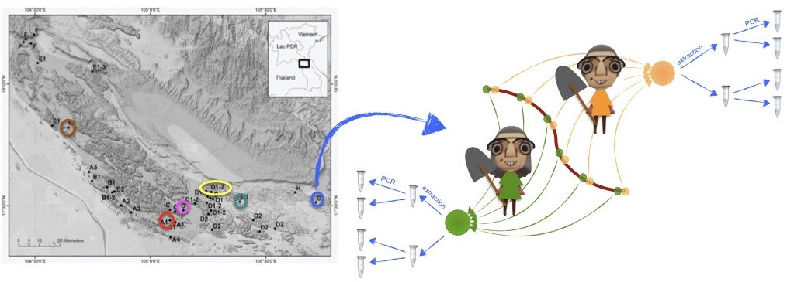

```{r setup, include = FALSE}
knitr::opts_chunk$set(
  collapse = TRUE,
  comment = "#>"
)
```

# Introduction

What if the sampler had an effect on DNA metabarcoding results? What is the extent of technical variability in DNA metabarcoding experiments? To further illustrate how one can further use `metabaR` to manipulate DNA metabarcoding data, we will address these questions with a new dataset, available in the `metabaR` companion data repository: https://github.com/metabaRfactory/metabaR_external_data.


# The `karst_euk` dataset

The `karst_euk` dataset is an object of class `metabarlist`. The data were obtained from an environmental DNA (eDNA) metabarcoding experiment aiming to assess the turnover of soil eukaryotes in karsts ecosystems, often seen as "terrestrial islands". In these ecosystems, dispersal is strongly limited by the singular topology of the area, and genetic/ecological drifts are expected to be important processes locally. 

Sampling was conducted across several kast mountains in Laos, as shown in the figure below. At each sampling site, two composite soil samples were made by two different samplers, one by Jean and one by Yvette. These composite samples are a mix of soil cores collected along a transect, as indicated in the figure. Each of these composite soils was then subjected to DNA extraction in duplicates, using an extracellular DNA extraction protocol [@taberlet2018environmental]. On each DNA extract, the v7 region of the 18S rRNA gene was then amplified by PCR in duplicates following previously described protocols [@zinger2019body] and the Euka02 primer pair [@taberlet2018environmental], and finally sequenced on an HiSeq Illumina platform with the paired-end technology. The retrieved data were then processed using the OBITools [@boyer:2016:00] package, including denoising using the `obiclean` command. Each entry in this table is the equivalent of an ASV (amplicon sequence variant) or the representative sequence of a MOTU.   

{width=100%}

Given this setup, one expects strong differences in community composition across sites, caused by dispersal limitation, and - hopefully - minimal technical variation caused either by the extraction, PCR, and sampler.

# Data import 

The dataset can be imported in `R` as follows  
```{r loaddata}
dir <- tempdir()
url <- "https://raw.githubusercontent.com/metabaRfactory/metabaR_external_data/master/"
karst_euk_file <- "karst_euk.rds"
karst_euk_url = paste(url, karst_euk_file, sep="")
karst_euk_path <- file.path(dir, karst_euk_file)
download.file(karst_euk_url, karst_euk_path)

karst_euk <- readRDS(karst_euk_path)
```

One can then use `metabaR` to display the summary statistics of the `karst_euk` dataset

```{r karst_euk_data}
library(metabaR)
summary_metabarlist(karst_euk)
```

The `karst_euk` dataset consists of 48 PCR products corresponding to 12 composite, biological samples in total. It does not contain experimental negative or positive controls, which is why the summary statistics are the same between *pcrs* and *samples*.


```{r karst_euk_data1}
colnames(karst_euk$pcrs)
```

In karst_euk, the columns of the `pcrs` table correspond to:

- `"sample_id"`: a vector indicating the biological sample origin of each *pcr* (e.g. the sample name), here a composite sample collected by a given sampler.    
- `"extraction_id"`: a vector indicating the extraction origin of each *pcr* (duplicate extraction for each *sample*).    
- `"type"`: a vector containing only the value "sample", as no controls are included in this experiment.    
- `"control_type"`: a vector containing only the value `NA`, as no controls are included in this experiment.   


```{r karst_euk_data2}
colnames(karst_euk$samples)
```

The columns of the `samples` correspond to:
- `"Site"`: the sampling site.    
- `"avg_N"`: the latitude (decimal degrees) averaged across each sampling point of the same site.     
- `"avg_E"`: the longitude (decimal degrees), averaged as for latitudes. 
- `"avg_alt"`: the elevation (m.a.s.l.), averaged as above.   
- `"sampler"`: the name of the sampler.


# Diagnostic plots

## Basic visualisation

As the dataset contains neither negative / positive controls, nor information on the pcr design (i.e. PCR plates and wells), several functions of the `metabaR` package cannot be used. Still, it enables handling this multi-layer data for more basic visualisation purposes. For example, the distribution of sequencing depth and number of MOTUs per samples can be visualized as follows

```{r diag1, message=F, warning=F, fig.width=6, fig.height=3, fig.align="center"}
# Compute the number of reads per pcr
karst_euk$pcrs$nb_reads <- rowSums(karst_euk$reads)

# Compute the number of motus per pcr
karst_euk$pcrs$nb_motus <- rowSums(karst_euk$reads>0)

# load ggplot2
library(ggplot2)

# Plot the distribution of #reads 
a <- 
  ggplot(karst_euk$pcrs, aes(x=nb_reads)) + 
  geom_histogram(color="grey", fill="white", bins=20) + 
  theme_bw() + expand_limits(x=0) +
  theme(panel.grid = element_blank()) + 
  labs(x="# reads", y="# PCRs")

# Plot the distribution of #motus
b <- 
  ggplot(karst_euk$pcrs, aes(x=nb_motus)) + 
  geom_histogram(color="grey", fill="white", bins=20) + 
  theme_bw() + 
  theme(panel.grid = element_blank()) + 
  labs(x="# MOTUs", y="# PCRs")

# Combine plots into one
library(cowplot)
ggdraw() + 
  draw_plot(a, x=0, y=0, width = 0.5) + 
  draw_plot(b, x=0.5, y=0, width = 0.5)
```

These very basics plots already suggest that 3 *pcrs* have very low diversity. They somehow behave like negative controls where some contaminants have been amplified. 


## Sequencing depth and coverage 

Let's construct the rarefaction curves with the `hill_rarefaction` function so that to obtain an estimate of $^{q}D$ and $Coverage$. `nboot` is low in the example below to limit the computing time.

```{r hill, message=F, warning=F, fig.width=7, fig.height=4, fig.align="center"}
#build rarefaction curves
karst_euk.raref <- hill_rarefaction(karst_euk, nboot = 20, nsteps = 10)


#draw by coloring the curves by sampler
# Define a vector containing the Material info for each pcrs 
sampler <- karst_euk$samples$sampler[match(karst_euk$pcrs$sample_id,
                                                rownames(karst_euk$samples))]

# Use of gghill_rarefaction requires a vector with named pcrs
sampler <- setNames(sampler,rownames(karst_euk$pcrs))

# Plot
p <- gghill_rarefaction(karst_euk.raref, group=sampler)
p + scale_fill_manual(values = c("orange","chartreuse")) +
  scale_color_manual(values = c("orange","chartreuse")) +
  labs(color="Sampler")
```

At a first glance, it seems that Jean's samples are more diverse in abundant/intermediate sequences than Yvette's ones. 

# Flagging spurious MOTUs

## Potential contaminants

This dataset does not include negative controls to enable detecting potential contaminants objectively. Still, we identified above some *pcrs* with very low diversity that may correspond to *pcrs* without DNA template and where reagents contaminants were amplified. Let's see if these have a particular composition as compared to the other samples. This can be done by hijacking the `contaslayer` function as follows:

```{r conta1, message=F, warning=F, fig.width=6, fig.height=3, fig.align="center"}
# set low-diversity pcrs as controls of e.g. pcrs
karst_euk$pcrs$control_type[which(karst_euk$pcrs$nb_motus<100)] <- "pcr"
karst_euk$pcrs$type[which(karst_euk$pcrs$nb_motus<100)] <- "control"

# run contaslayer
karst_euk <- contaslayer(karst_euk, 
                         control_types = "pcr",
                         output_col = "not_a_pcr_conta")
```

And then display some basic information on these potential contaminating sequences.

```{r conta2, message=F, warning=F, fig.width=6, fig.height=3, fig.align="center"}
# print taxonomy of MOTUs most abundant in low-diversity samples
library(kableExtra)
dt <- karst_euk$motus[!karst_euk$motus$not_a_pcr_conta,
                     c("count","best_identity",
                       "scientific_name", "sequence")]
dt$best_identity <- round(dt$best_identity)
colnames(dt) <- c("total # reads", "similarity to ref DB", "taxon name", "sequence")

kable(dt[order(dt[,1], decreasing = TRUE)[1:10],], row.names=T) %>%
  kable_styling(bootstrap_options= c("striped", "hover", "condensed"), 
                font_size = 8, full_width = F)
```

From the taxonomy of these potential contaminant sequences, it is difficult to say whether these sequences are actual contaminants. One way to further investigate this is to see how these sequences are distributed across *pcrs*. 

```{r conta3, message=F, warning=F, fig.width=7, fig.height=4, fig.align="center"}
library(reshape2)
tmp <- melt(karst_euk$reads[,!karst_euk$motus$not_a_pcr_conta])

ggplot(tmp, aes(x=Var2, y=Var1, size=ifelse(value==0, NA, value))) + 
  geom_point() + labs(size = "# reads") +
    theme(axis.text.x = element_text(angle=45, hjust = 1))
```

The most abundant contaminant identified in the table above is present in all samples and is, therefore, most likely a contaminant. In addition, other potential contaminant sequences are present in 7-8 successive samples, which are likely in the same column in the PCR plate. These features strongly suggest that these sequences are indeed artefactual and should be excluded from the dataset. 

## Flagging spurious MOTUs and non-target MOTUs

Non-target MOTUs cannot be detected in this particular dataset, because the taxonomic assignments have been made using a reference database that only contains eukaryotic sequences.    

One can, however, still identify MOTUs whose sequence is too dissimilar from references, by drawing the distribution of MOTU similarity scores, weighted and unweighted by their relative abundance.   

```{r nontarget3, message=F, warning=F, fig.width=6, fig.height=3, fig.align="center"}
# Plot the unweighted distribution of MOTUs similarity scores 
a <- 
  ggplot(karst_euk$motus, aes(x=best_identity)) + 
  geom_histogram(color="grey", fill="white", bins=20) + 
  geom_vline(xintercept = 0.8, col="orange", lty=2) + 
  theme_bw() + 
  theme(panel.grid = element_blank()) + 
  labs(x="% similarity against best match", y="# MOTUs")

# Same for the weighted distribution
b <- 
  ggplot(karst_euk$motus, 
         aes(x=best_identity, y = ..count.., weight = count)) + 
  geom_histogram(color="grey", fill="white", bins=20) + 
  geom_vline(xintercept = 0.8, col="orange", lty=2) + 
  theme_bw() + 
  theme(panel.grid = element_blank()) + 
  labs(x="% similarity against best match", y="# Reads")

# Combine plots into one
library(cowplot)
ggdraw() + 
  draw_plot(a, x=0, y=0, width = 0.5) + 
  draw_plot(b, x=0.5, y=0, width = 0.5)
```

As in the `soil_euk` dataset, we may consider any MOTU as degraded sequences if its sequence similarity is < 80% against its best match in the reference database. 

```{r nontarget5, message=F, warning=F}
# Flag not degraded (TRUE) vs. potentially degraded sequences (FALSE)
karst_euk$motus$not_degraded <-
  ifelse(karst_euk$motus$best_identity < 0.8, F, T)

# Proportion of each of these over total number of MOTUs
table(karst_euk$motus$not_degraded) / nrow(karst_euk$motus)

# Intersection with other flags
table(karst_euk$motus$not_a_pcr_conta, 
      karst_euk$motus$not_degraded)
```

No intersection is found between degraded MOTUs and potential contaminants. 

# Assessing signal reproducibility

Here, one can assess the signal reproducibility at different levels:    
- the DNA extract level   
- the composite sample level   
- the site level.


```{r pcrsalyer1, message=F, warning=F, fig.width=5, fig.height=4, fig.align="center"}
# DNA extraction
comp1 = pcr_within_between(karst_euk, replicates = karst_euk$pcrs$extraction_id)
a <- 
  check_pcr_thresh(comp1) + 
    scale_color_manual(labels = c("between DNA extracts", "within DNA extracts"), 
                       values = c("coral2", "cyan3"))

# composite sample
comp2 = pcr_within_between(karst_euk, replicates = karst_euk$pcrs$sample_id)
b <- 
  check_pcr_thresh(comp2) + 
    scale_color_manual(labels = c("between samples", "within DNA samples"), 
                       values = c("coral2", "cyan3"))

# sampler
karst_euk$pcrs$sampler_id <- karst_euk$samples$sampler[match(karst_euk$pcrs$sample_id, 
                                                             rownames(karst_euk$samples))]
comp3 = pcr_within_between(karst_euk, replicates = karst_euk$pcrs$sampler_id)

comp3$bar_dist <- rep(comp3$bar_dist, 2) # trick to plot a density from 1 value

c <- 
  check_pcr_thresh(comp3) + 
    scale_color_manual(labels = c("between samplers", "within DNA samplers"), 
                       values = c("coral2", "cyan3"))

library(cowplot)
ggdraw() + 
  draw_plot(a, x=0, y=0.6, height = 0.3) + 
  draw_plot(b, x=0, y=0.3,  height = 0.3) + 
  draw_plot(c, x=0, y=0,  height = 0.3)
```

These plots suggest that the PCR and extraction reproducibility is high. By contrast, reproducibility per sampler is low, which means that the biological differences between samples are stronger than potential effects introduced by the sampler identity per se. 

Let's verify this with an ordination visualisation by hijacking the `check_pcr_repl` function:

```{r pcrsalyer3, message=F, warning=F, fig.width=5, fig.height=4, fig.align="center"}
# Distinguish between pcrs obtained from the different sampling sites
mds = check_pcr_repl(karst_euk, 
                     # display sites with different colors
                     groups = karst_euk$samples$Site[match(karst_euk$pcrs$sample_id,
                                                           rownames(karst_euk$samples))], 
                     # use funcpcr to differentiate samplers instead of good vs. failed pcrs.
                     funcpcr = karst_euk$pcrs$sampler_id == "Yvette") 

mds + 
  labs(color = "Sites", shape="Sampler") + 
  scale_shape(labels=c("Jean", "Yvette"))
```

The variability across sites is hence far larger than between samplers and technical replicates. But the sampler effect is not negligible. One can observe, however, some PCR outliers (site D1-2 sampled by Jean, or site C sampled by Yvette) that can be flagged with the function `pcrslayer`. We refer to the ["Let's metabaR" tutorial](https://metabarfactory.github.io/metabaR/articles/metabaRF-vignette.html) for further usage description for this function.

# Data final cleaning and aggregation

We presented here a succinct description of the data cleaning process for the `karst_euk` dataset. Note that not all steps are shown here, and we refer the user to the ["Let's metabaR" tutorial](https://metabarfactory.github.io/metabaR/articles/metabaRF-vignette.html), based on the `soil_euk` dataset for a complete process of signal flagging and cleaning, including the last steps of the process, i.e. removal of flagged MOTUs/pcrs and data aggregation.

# References
